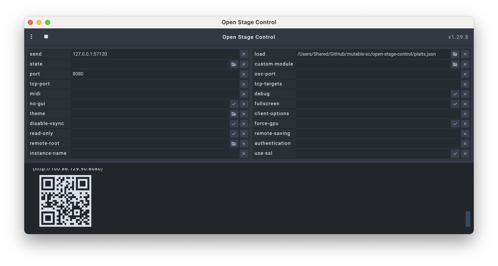

# Dreads

*Many twisted Plaits.*

Multi-instance Mutable Instruments Plaits synthesizer for Supercollider with presets, pattern sequencing, Open Stage Control user interface and OSC device targets.

## Requirements

**SuperCollider 3.13+** with these extensions:
- [MI-UGens](https://github.com/v7b1/mi-UGens/releases) (MiPlaits, MiVerb, MiClouds)
- [sc3-plugins](https://github.com/supercollider/sc3-plugins/releases) (CrossoverDistortion)

**Standalone applications:**
- [Open Stage Control](https://openstagecontrol.ammd.net/) (UI control interface)

## Installation

1. **Get the project**:
   - Install [GitHub Desktop](https://desktop.github.com/)
   - On the [Dreads repository page](https://github.com/msp/dreads), click "Code" → "Open with GitHub Desktop"
   - Choose a location to save the project

   

2. **Install SuperCollider extensions** to `/Library/Application Support/SuperCollider/Extensions/`. More info about [installing extensions here](https://doc.sccode.org/Guides/UsingExtensions.html).
   - Download correct versions for your SC version and architecture (Intel/Apple Silicon)
   - Extract `mi-UGens/` and `sc3-plugins/` folders to Extensions directory

3. **Install [Open Stage Control](https://openstagecontrol.ammd.net/docs/getting-started/introduction/#installation)**
   - macOS: If blocked by Gatekeeper or "damaged and can't be opened" error, run: `xattr -dr com.apple.quarantine /Applications/open-stage-control.app` ([source](https://disable-gatekeeper.github.io))

4. Restart SuperCollider

5. Verify installation:
   ```supercollider
   MiPlaits.dumpInterface;
   CrossoverDistortion.dumpInterface;
   ```

## Setup

1. **Open** `plaits.scd` in Supercollider

2. **Execute setup block** (section 1) - boots server and loads dependencies

3. **Execute play block** (section 2) - starts effects and sequencer

4. **Launch UI**:
   - Start Open Stage Control
   - Configure launch settings:
     - **send**: `127.0.0.1:57121` (or check `NetAddr.langPort` in SC)
     - **port**: `8080`
     - **load**: Path to `open-stage-control/plaits.json` in your project directory
   - Click the play button (▶) to start

   

## Usage

**UI Controls:**
1. **Load preset** - Select from dropdown to load a saved preset
2. **Play/Stop** - Start/stop pattern playback
3. **Snapshot** - Capture current state to preset
4. **Save** - Overwrite current preset with current state
5. **Reload** - Reload preset from last saved version

## Architecture

- **3 Plaits instances** with independent sequencing and modulation
- **Global send effects**: MiClouds, MiVerb, filtered ping-pong delay
- **Pattern-based sequencing** with per-instance duration/pitch/timbre control
- **Preset system** with auto-save and templating

## Troubleshooting

**Run diagnostics first:**
Open `diagnostics.scd` in SuperCollider and execute the block to check your system configuration. This will verify all extensions are installed correctly and show your current setup.

**No sound:**
- Check `s.meter` - are levels showing?
- Verify `~using6_1` matches your audio hardware (line 18 in `plaits.scd`)
- Run `~voiceGroup.freeAll` to clear stuck synths

**UI not responding:**
- Enable `OSCFunc.trace(true)` in SC to see incoming OSC messages
- Check Open Stage Control send port matches `NetAddr.langPort` shown in diagnostics
- Verify OSCdefs are loaded (run play block in `plaits.scd`)

**Extensions not loading:**
- Ensure extensions match your SC version (3.13, 3.14, etc.)
- Check architecture (Intel vs Apple Silicon builds)
- Restart SC after installing extensions
- Run `diagnostics.scd` to verify installation

## Project Structure

```
plaits.scd              # Main entry point
diagnostics.scd         # System diagnostics and troubleshooting
lib/
  globals.scd           # Configuration and defaults
  synthdefs.scd         # Audio engine definitions
  sequencer.scd         # Pattern sequencer
  osc.scd              # OSC handlers and UI sync
  presets.scd          # Preset management
  utils.scd            # Helper functions
presets/plaits/        # Preset library
open-stage-control/    # UI definition
```
